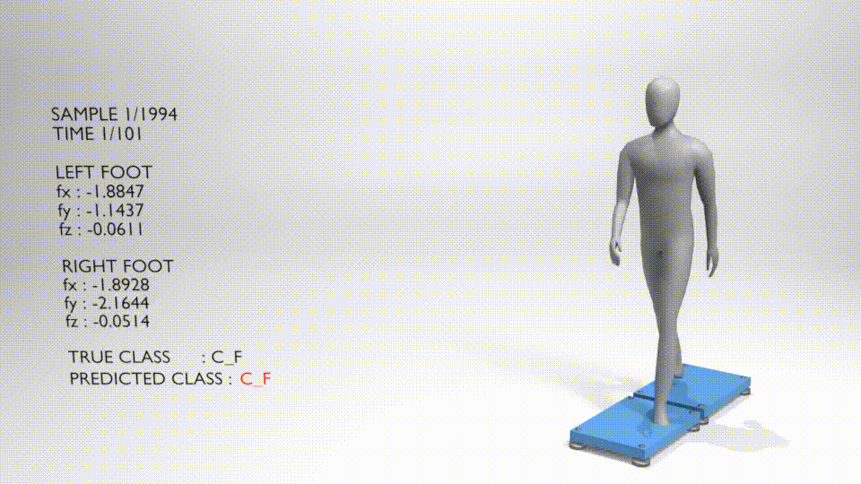

# GRF Gait Digital Twin

This repository contains the anonymized implementation for a ground reaction force (GRF)-based gait classification and digital twin visualization framework.

The framework includes preprocessing, Transformer-based gait classification, model training, checkpoint loading, and Blender-based visualization scripts for synchronizing gait-related outputs with a 3D digital twin environment.



## Repository Structure

```text
grf-gait-digital-twin/
├── checkpoints/
│   └── best_model.pt
├── preprocessing.py
├── model.py
├── train.py
├── blender_script.py
├── requirements.txt
└── README.md
```

## Files

* `preprocessing.py`: Preprocessing pipeline for GRF input signals.
* `model.py`: Transformer-based gait classification model.
* `train.py`: Training and evaluation script.
* `blender_script.py`: Blender Python script for visualizing model outputs in a digital twin environment.
* `checkpoints/best_model.pt`: Trained model checkpoint used for inference or reproducibility checks.
* `requirements.txt`: Python package requirements.

## Installation

Create a virtual environment and install the required packages:

```bash
conda create -n gait-env -y
conda activate gait-env
pip install -r requirements.txt
```

## Usage

### Training

```bash
python train.py
```

The training script loads the preprocessed GRF data, trains the classification model, and saves model checkpoints and evaluation outputs according to the paths configured in the script.

### Model Checkpoint

The trained checkpoint is provided at:

```text
checkpoints/best_model.pt
```

This checkpoint can be loaded for inference or evaluation using the model architecture defined in `model.py`.

### Blender Visualization

The Blender visualization script is provided as:

```text
blender_script.py
```

To use it, open the Blender project file, go to the scripting workspace, load `blender_script.py`, and run the script inside Blender. The script is designed to synchronize gait-related model outputs with a digital twin visualization.
